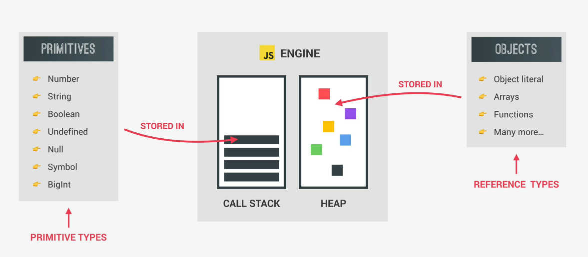
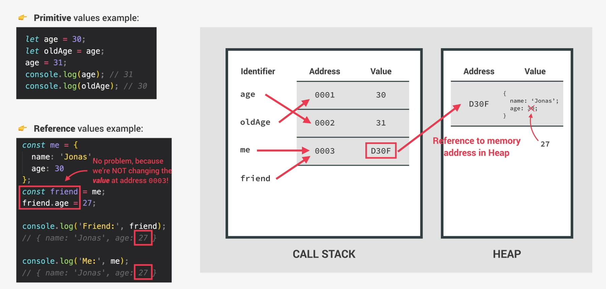

# Primitives vs Objects (Primitive vs. Reference Types)

When we are talking about primitves and objects, in respect of memory management, we also like to refer to them as primitve types and reference types. This is because primitives are stored in the call stack, more precisely in their respective execution contexts. Objects on the other hand are stored in the memory heap of the javascript engine.

**Primitve values:**
First Javascript creates an unique identifier with the variable name in the call stack. Then a piece of memory will be allocated with a certain address. Finally the value will be stored in memory at the specified address. **Important**: The identifier points to the address and **NOT** the value itself.

In this example <code>age</code> is not equal to 30, but it is equal to the memory address 0001, which holds the value 30. When <code>oldAge</code> is defined and is set equal to age, it simply points to the same memory adress as age. When redefining age and setting it to 31, Javascript will create a new memory address, since the value at a certain memory address is immutable. After that the age identifier simply points to the new address.

**Reference values:**
When a new object is created, it is stored in the memory heap. Like in the call stack an address is connected to the value. But the object identifier does **NOT** point directly to the created memory address in the heap. Insted it points to a newly created address in the call stack, which points to the address in the heap, which holds the value of the object. So the piece of memory in the call stack holds a reference of the piece of memory in the heap, which holds the object.
A reason for this behaviour is that objects may become to large to be able to hold in the stack. This is why they are stored in the heap, which is like an unlimited memory pool.

In this example the <code>me</code> object is created and stored in the memory heap under a certain adress. The identifier in the call stack then points to an address in the callstack which holds a reference of the address in the memory heap as its value. Now, if we create the <code>friend</code> object and set it equal to the <code>me</code> object, we think we are copying the object's values. But insted we create a new identifier, which points to the same adress in the heap. If we are now changing a value of the object, it will be changed in the heap and since both identifiers <code>me</code> and <code>friend</code> point to the same direction, the values will be changed for both of them. This concludes, that everytime you think you are copying an object, you just create a new variable, which points to the same object, instead of creating a new object in the heap.

This also explains why we are able to change the object value of the <code>friend</code> variable which is defined with const. We are not changing the value of the const identifier in the callstack, because this value still just holds the reference to the address in the heap. Only in the heap we are changing the value.

In order to really copy an object we can use a function called Object.assign(). This simply merges two objects and returns a new one.

    const jessica = {
        firstName: 'Jessica',
        lastName: 'Williams',
        family: ['Alice', 'Bob']
    };

    const jessicaCopy = Object.assign({}, jessica);
    jessicaCopy.lastName = 'Davis';
    jessicaCopy.family.push('Mary');    ==> will change the values in both jessica and jessicaCopy

    console.log('Before marriage:', jessica);
    console.log('After marriage:', jessicaCopy);

A problem with this method is that it only works on top level. So an object inside an object will still refer to the same adress in the heap. We say that <code>Object.assign()</code> only creates a 'shallow copy' and not a 'deep clone', which is what we like to have in this example.

To create a deep clone is beyond the scope at this point of time. But a way to do this would be to include a library like 'lodash'.