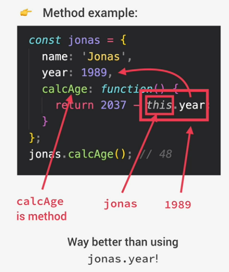

# This keyword

The this keyword or this variable is a main part of every execution context. It is explicitly for every execution context (or every function, except for arrow function). We say that it points to the owner of the function.
The value of the this variable is NOT static. It depends on how the function is called and its value is only assigned when the function is actually called.

- Method:

  - the this keyword points to the object that is **calling** the method

- simple function call:

  - For strict mode: this = undefined;
  - otherwise: this will point to the global object (in case of browser = window object)

- arrow functions:

  - this = this keyword of the surrounding function, since arrow functions don't get their own this keyword
  - also called 'lexical this'

- Event listener:
  - this = DOM element the handler function is attached to

IMPORTANT: this does NOT point to the function itself or the variable environment of the function

### Examples

1.  **This keyword in global scope:**

        console.log(this)   ==> refers to global scope (in the browser the window object)

2.  **Simple function call without attachment to an object:**

        const calcAge = function(birthYear) {
        console.log(2037 - birthYear);
        console.log(this)   ==> returns undefined in strict mode, in sloppy mode it will return global object
        }
        calcAge(1991);

    This applies for simple function calls, meaning the function not being attached to an object, hence not having an owner.
     

3.  **Arrow Function:**

        const calcAgeArrow = birthYear => {
        console.log(2037 - birthYear);
        console.log(this);  ==> returns the global object
        }
         calcAgeArrow(1991);

    Since the arrow function does not get its own this keyword, but uses the lexical this keyword, it will use the this keyword of its parent scope, in this the global object
     

4.  **This keyword inside of a method:**

        const max = {
            year: 1991,
            calcAge: function() {
                console.log(this);  ==> returns max object with all its properties;
                                        max is the owener of the method
                console.log(2037 - this.year)
            }
        }
        max.calcAge()

5.  **This keyword being called by a another method:**

        const matilda = {
            year: 2017;
        }

        matilda.calcAge = jonas.calcAge;    ==> copying jonas.calcAge to matilda object,
                                            called METHOD BORROWING

        matilda.calcAge();  ==> method points to matilda!

    Even though the method was written inside the jonas object, the this keyword points to matilda, since matilda is the object that is calling the method.
     

6.  **Arrow function inside a method:**

        const max = {
            year: 1991,
            calcAge: function() {
                console.log(2037 - this.year)
            },

            greet: () => {
              console.log(`Hey ${this.firstName}`);
            },
        };
        max.greet()

    <code>max.greet()</code> will return undefined, because arrow function does not have its own this keyword, and the curly brackets in this case are not forming a block, since they are the syntax for object literals. Therefore the method will refer to the window object (in the browser) and look for a property called firstName, which cannot be found.
    **BUT** when we declare variables with <code>var</code> on the global scope, the var keyword will write a property to the global objec, in contrast to let and var. This again is an argument against var.
     

    **Best practice**:
    First: Do not use var!
    Second: Do not use arrow functions as a method! Even if you are not using the this keyword, as a general rule, so you do not have to think about which function you should use.
     

7. **Function insode of a method:**

        const max = {
            year: 1991,
            calcAge: function() {
                console.log(2037 - this.year)

                const isMillenial = function() {
                  console.log(this);    ==> returns undefined
                  console.log(this.year >= 1981 && this.year <= 1996); ==> Uncaught TypeError:
                                                                        Cannot read property 'year' of undefined
            };
            isMillenial();
            },

        };
        max.calcAge()

    This error happens, because <code>isMillenial()</code> is just a regular function call inside of a method and the rule is that this keyword in a regular function calls is undefined.
    An ES5-like **workaround** could be to define a const varibale called <code>self</code> or <code>that</code> outside of the isMillenial function and set its value to this. We then are able to replace the this keyword inside of the function with self to refer to the object.
    A more **modern solution** could be to simply use an arrow function, since the this does not get its own this keyword, but uses the this keyword of its parent function or scope, in this case the calcAge method. Basically an arrow function inherits the this keyword from its parent scope.
     

8. **Arguments keyword:**
    Every regular function (expression or declaration) gets an arguments keyword, which is essential when we input an unknown number of arguments into a function. The arguments keyword saves all the arguments inside of an array. For example we can now loop through all the arguments using <code>i<arguments.length</code>.

        const addExpr = function (a, b){
          console.log(arguments);
          return a + b;
        }
        addExpr(2, 5);
        addExpr(2, 5, 8, 12);   ==> valid input, the arguments keyword

    **BUT:** The arguments keyword is **NOT** available in arrow functions.