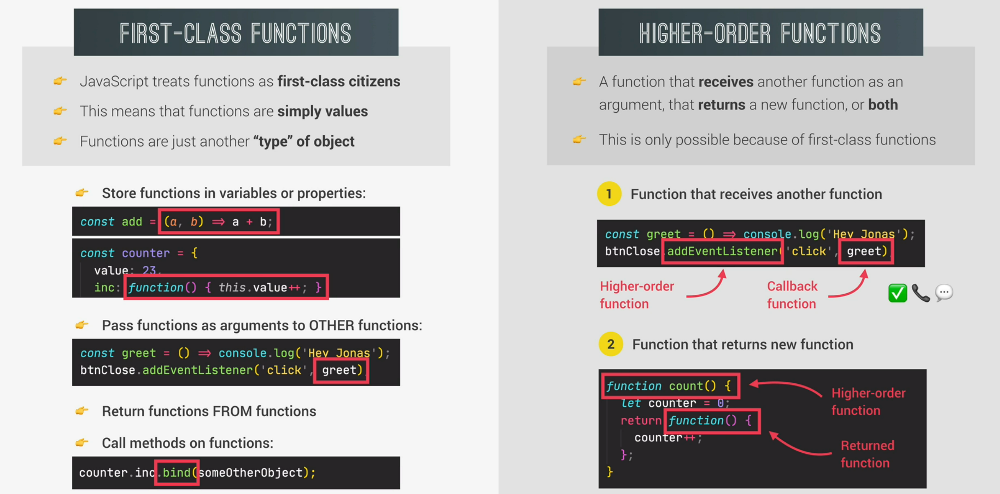

# First-Class vs. Higher-Order functions

Javascript differentiates between first-class functions and higher-order functions. Since functions are just other types of objects and objects are treated like values, functions are also treated just like values. We say that Javascript treats functions as first-class citizens. This allows us store functions into variables, create methods in objects and do all the things that we can do with values.

This behaviour allows us to create higher-order functions, which take other functions as an argument or return a function or both. The function passed to a higher-order function is often referred to as callback function. We can create our own higher order function or use the numerous built in ones like array.prototype.map.

In practice, first-class functions is a feature of Javascript, meaning the the concept that functions are treated just like a value.
There are, however, higher-order functions in practice, which are possible, because the language supports first-class functions.



## Creating own higher-order functions

In this example we create two functions. The first transforms a string into one word, the second one capitalizes the first word of a string.

We then create a higher order function, which takes a string and a callback function as an argument. Inside this function we can transform the string by whatever function we pass in. So when calling the transformer function we can easily transform a string to either one lower case string or capitalize the first word.

Inside the function we can also log the name property of the function with fn.name.

```javascript

const oneWord = function(str) {
    return str.replaceAll(' ', '').toLowerCase();
} 

const upperFirstWord = function(str) {
    const [first, ...others] = str.split(' ');
    return [first.toUpperCase(), ...others].join(' ');
}

//Higher-order function
const transformer = function(str, fn) {
    console.log(`Transformed string: ${fn(str)}`);

    console.log(`Transformed by: ${fn.name}`);
}

transformer('Javascript is fun', upperFirstWord)

transformer('Javascript is fun', oneWord)

```

## Callback functions

Callback functions are frequently used in Javascript. They help us split up our code into several parts, which then can be reused and interconnected.
The second and way more important advantage is, that callback functions allow us to make abstractions. Abstraction basically means hiding the detail of some code implementation and showing only the essential features. For example the transformer function is only concerned with transforming a string, but does not care how it is actually done. It is delegating the process to a lower level of function. This is why it is called a higher order function, because it operatres on a higher level of abstaction, leaving the low level details to the "low-level" functions.

## Functions returning functions

Functions can return other functions, which will come in handy regarding functional programming. In this example we have a greet function, which takes in a greeting as an argument. The function immediately returns another anonymous function, which takes the name as an argument.

    const greet = function(greeting) {
        return function(name) {
            console.log(`${greeting} ${name}`)
        }
    }

Then we can store the greet function in another variable, invoking it with an argument passed into the function. Afterwards we are basically able to target the inner function of the outer function from the global scope by passing arguments to the variable holding the greet function.

    const greeterHey = greet('Hey');
    greeterHey('Max');  ==> outputs: 'Hey Max'
    greeterHey('Jonas');  ==> outputs: 'Hey Jonas'

This can be written in a very concise way, using arrow functions: 

    const greet = greeting => name => console.log(`${greeting} ${name});

You might think, that this looks weird, since we are not invoking the outer function again with a new argument for the greeting. How does Javascript now what to take for a greeting? At this point, it is enough to know, that it happens because of closures. Simply put, closures remember the outer function scope even after creation time.

