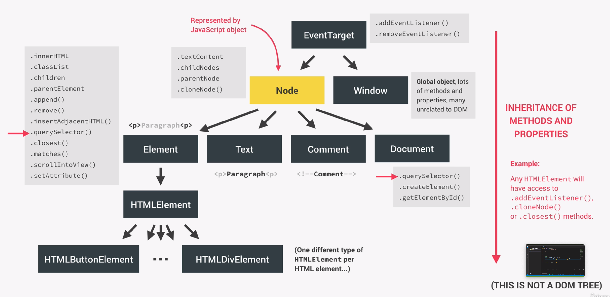

# The DOM

The DOM (Document Object Model) is a complete representation of the HTML content, so we can access and change HTML elements via Javascript.
The DOM is structured like a family tree and we refer to the single elements as children, siblings, parents etc. The single representated elements are also called nodes.

**The DOM does not acutally belong to Javascript...**
... but instead belongs to the group of WEB API's (Application Programming Interfaces). Simply put, Web API's are like libraries written in Javascript. The DOM-library is automatically available for us without installation. There is an official DOM-specification for all browsers, so that the DOM works the same way in every one of them.

## How the DOM works

The DOM can be seen as the interface between our Javascript code and the browser, or, more specifically, HTML documents that are rendered in and by the browser. The DOM therefore allows our code to interact with the browser. We can write Javascript to create, modify and delete HTML elements, set styles, classes and attributes, and listen and respond to events. A DOM tree is generated from an HTML document, which is a tree-like structure made out of nodes. The DOM is vastly complex API with a lot of methods and properties to interact with the DOM tree. The DOM tree consists of different kinds of nodes, e.g. one being a HTML element and another being just plain text. Methods and properties are organized into these different kinds of nodes.

### Organization

Every node in the DOM tree is of the type 'node' and every node is represented in Javascript by an object, which gets access to specific node methods and properties. But, every node can be further specified by classifying it into "child-types", which are element, text, comment and document. The element sub-type gives each HTML element access to a wide variety of different useful properties, such as classList or innerHTML, and methods, like closest() or querySelector().

The element sub-type internally has an HTML element child-type, which in turn has one different type for each HTML element that exists. This means that there is a respective child-type for a div and another one for a button and so on. This is necessary, since every HTML element can have unique attributes (src on  for example), which are stored in the DOM by creating a child-type for every element.

The document-type gives access to methods like getElementbyID or querySelector(), which is also available on the element type.

In order to listen to events, Javascript has a EventTarget type, which is a parent of the node type as well as the window type, which is a global object and has many methods and properties, of which many are not related to the DOM.

Just like prototypal inheritance, every child-type also gets access to the methods and properties of their parent node types. For example, this is the reason why we can call the event listener on every node in the DOM tree.

