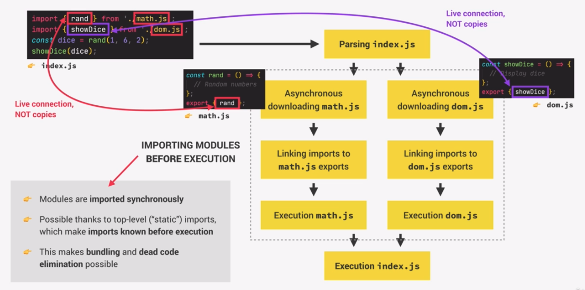

# Modern Javascript Development: Overview

In the earlier days of Javascript it was common to write all of the code in a single or only a few scripts. Nowadays we divide our projects into multiple modules, which can share data between them. This can make our code more organised and maintainable. A great advantage of modules is that we can also integrate third party modules or packages into our projects. We can use npm(node package manager), which was originally created together with and for node.js, in order to gain access to all kinds of packages. We therefore install npm on our machine. Hence, npm is both the repository of modules and the software to install an manage the packages.

When working with real-world applications, the development phase is often ended with a build process. In this process a Javascript bundle is build, which is then ready to go to production. Building processes can get quite complex, which is why we only look at an oversimplified example, which includes two steps:

1. Bundling: During bundling all the modules are joined and compressed into one files. This step is very important because of backwards-compatability for older browser, which do not support modules. Additionally, it is also benefital for performance.

2. Transpiling/Polyfilling: This step basically converts all of modern ES6 features and syntax back to ES5 for compatability reasons. A popular tool for doing this is called **Babel**.

In order to implement this build process, we can use tools like webpack and parcel, which are called Javscript bundlers. The big difference between these two bundlers, is that webpack can be quite different to set up, because it needs a lot of manual configuration, while Parcel is a non-configuration bundler and works out of the box.

## Modules

A module is a reusable piece of code that encapsulates implementation details of a certain part of our projects. A module is usually a standalone file, but does not have to be. They can also be seen as samall building blocks that we put together to build complex applications.
A module always contains executable code, but can also include imports and exports. We can export values, but also entire functions, from a module to another one. Whatever we export from a module we call the **Public API**. When importing a module into another module, this imported module is also referred to as a **dependency**, because the code depends on the code of the imported module. This is true for all modules in all programming languages.

A big advantage of seperating your code into smaller building blocks is that each module can be developed in isolation. This is called isolating components and allows us to develop modules and write code without the need to think or understand the whole codebase. This makes it easier to collaborate on a larger team.

Another advantage of moudles is that they allow us to abstract our code. We can implement low-level code into modules and import these abstractions into other modules.

As of ES6, Javascript as a built-in natvie module system. Each module is stored in a file and each file represents exactly one module. Modules behave differently that regular scripts. 

- One of those differences is that top-level variables are **scoped to the module** and not the global scope. This means that variables are private to the module by default. The only way that another module can access a value that is inside of a module is by exporting the value from the module that holds the value. Therefore, using modules can prevent **global name space pollution**.

- Additionally, modules are always executed in strict mode, in contrast to script, which are executed in sloppy mode by default. Therefore we do not have to declare strict mode manually.

- The this keyword is always set to undefined at the top level, while in the browser runtime, with scripts the this keyword always points to the window object.

- Modules allow us to import and export value between other modules, using the import export syntax. This is impossible when using regular scripts. It is important to note that imports and exports need to happen at the top-level and that they are **hoisted**. All the importing statements of the file that imports the modules are basically hoisted to the top. This is also why we conventionally write all the importing statements at the top of the file.

- If we want to use modules, we need to set the type of the linked script in our HTML file. We do this by adding "type="module" inside the script tag.

- When downloading a module, no matter if a module is loaded from HTML or when importing a module from another, this is always done an asynchronous way. Regular scripts on the other hand are always loaded in a blocking, synchronous way, unless we use the async or defer attributes.

## Importing Modules: Concept



During the parsing of the code (reading before execution), imports are hoisted. This means that the whole process of importing modules happens before the code in the main module is executed. This process also happens in a synchronous way, which means that, only after all the to-be-imported modules are loaded and executed, the code of the main module will be executed. This is only possible, because of top-level imports, which makes imports known before execution. If we were able to import a module inside of a function, then this function would need to be executed before the import code is executed, which would make it impossible for imports to be processed in a synchronous way.

Being able to parse imports in a synchronous way makes bundling and the elimination of dead code possible.

After parsing process has figured out which modules need to be imported, these modules are downloaded from the server. The downloading itself is handled in an asynchronous way, it is only the importing operation that is handled synchronously. After Javascript has finished downloading the modules, the imports in the main module are linked to the exports of the downloaded modules. For example math.js exports a function called rand(), and this export is linked to the {rand} import of the main module. Note that this link is not a copy, but a live connection. Any changes of the math modules will also affect the import of the main module. Basically, an import is only a reference to a an exported value, like a pointer. This behaviour is unique to ES6 modules and are not implemented like this in other programming languages. 

Finally the code in the imported modules is executed and with this the process of importing modules is finished. As a last step the code of the main module is now executed.

## Importing Modules: Practice

In order to create a new module, we first have to create a new Javascript file. Being able to import a module in another file, it is necessary to define the type of the script which should import a module. Therefore we need to add 'type="script"' into our HTML script tag.

If we want to export a value from a module, we can only do this on the top level. There are different ways of exporting values from a module, those are:

1. **Named exports**: This is the easiest way to export a value to another module, because we simply need to add the export keyword before the value.

    ```js
    export const addToCart = () => cart.push()

    const totalPrice = 237;
    const totalQuantity = 14;

    export {totalPrice, totalQuantity}
    /////////////////////////////////
    import {addToCart, totalPrice, totalQuantity} from './shopping.js'
    ```

    When importing those named exports, we have to give the import the exact same name as the original value. Using named exports, we can also export multiple values at the same time, which is the main use case for using named exports.

- **Renaming exports**: We can also rename exported values when they are exported or imported.

        ```js
        export {totalPrice as price, totalQuantity}
        /////////////////////////////////
        import{price, totalQuantity as quantity}
        ```

- **Importing the whole module**: We can import the whole code of an module and store it in an object. We then can reference that object when we want to use code from that module. This way kind of resembles the appearance of class.

        ```js
        import * as ShoppingCart from './shopping.js'

        ShoppingCart.addToCart('bread')
        ```

2. **Default exports**: We use default exports when we just want to export one value per module. We do not have give a name to the function or value we want to default export, as we do this when we import the default export. We do not have to wrap the name of the value in curly braces either.

```js
export default function(x,y) {
    console.log('Default Export')
};
/////////////////////////////////
import defaultExportExample from './shopping.js'
```