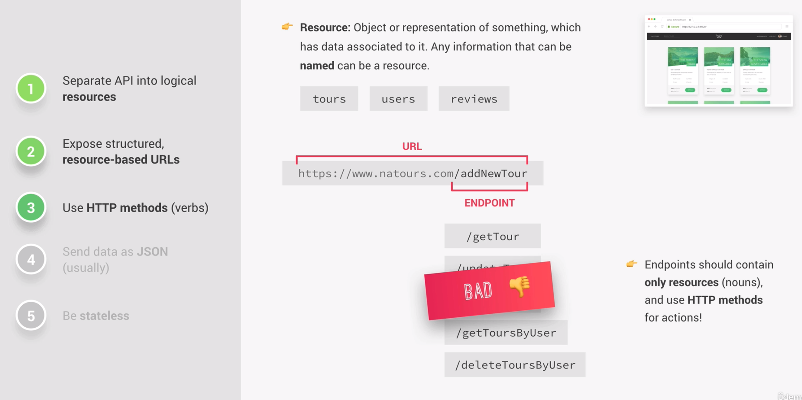
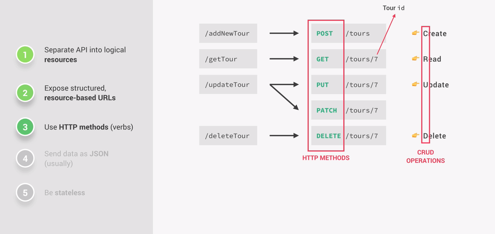
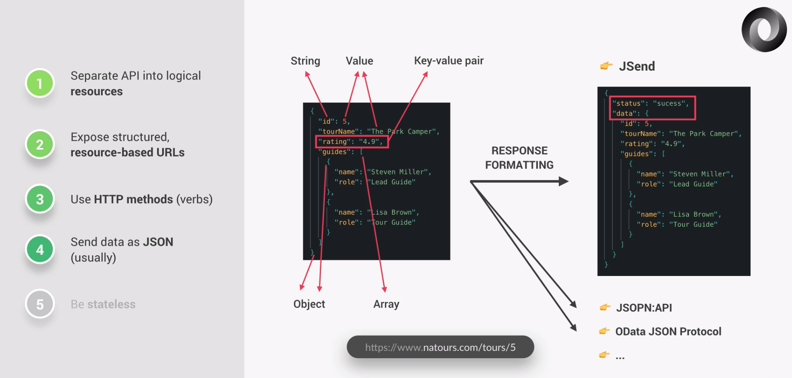
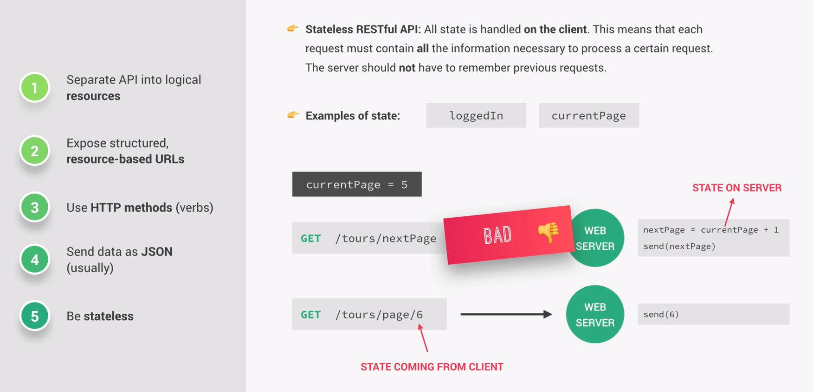

# APIs and Restful API Design

API stands for Application Programming Interface and represents a piece of software that can be use by another piece of software and allows their communication. Most of the time in the context of web development we talk about Web APIs, which, in simple termns, send data to the client when a requests comes in. But APIs are not only used to send data and are not always related to web development or Javascript. The "application" in API can be a lot of things, as long as the piece of software is relatively stand-alone. A few examples are NodeJs' fs or http modules, the browser's DOM, or in OOP, exposing methods to the public. All of these can actually be called an API.

REST, which stands for representational state transfer, is the most used API architecture today. REST offers a logical way of building web APIs, making them easy to consume. Therefore we need to follow a few principles.

#### 1. Separate API into logical resources

The data we want to share in the API should be divided into logical resources. A resource in the context of REST is an object or representation of something which has some data associated to it. Any information which can be named can be a resource. It is important to note that the resource has to be noun and not a verb. It is also a convention to always put the resource's name in the plural form.

It is also a good idea to version your API, for the case that you want to make changes to the API, but want all users who are version 1 to still be able to use it.

```js
app.get('api/v1/tour', ...)
app.get('api/v2/tour', ...)
```

#### 2. Expose structured, resource-based URLs

This means that in our URL endpoints only resources are allowed and we should HTTP methods for certain actions.



#### 3. Use HTTP methods

In this example, if we hit the /tours endpoint, we get back all the data. Now if we want to retrieve one tour we retrieve it by putting the id after another slash or in a search query.

We can use the GET request on a certain endpoint to retrieve or read the data. In order to add data to our REST API we use the same endpoint, but make use of the POST request. Usually no ID needs to be sent, because the server should automatically assign a new unique identifier for the new resource. If we want to update existing data we can either use the PUT or PATCH request. The difference between these two is that PUT expects the client to send the entire updated object, while PATCH expects only the part of the object that has been changed. Finally we can use the DELETE method to delete data by targeting it with an ID.

Those methods build the four CRUD operations, which stands for create, read, update and delete.



#### 4. Send data as JSON

The data that the client and server receive is usually in the JSON format. JSON is very similar to a Javascript object, which makes it very easy to read both for humans and computers. An important characteristic of JSON is that all of the keys need to be strings.

Before a JSON object is sent back to the client, usually the response is slightly formatted. There are a couple of standards, a renowned one is called Jsend. The simplest way involves creating a new object and adding a status message to it in order to inform the client whether the request was successful, failed or an error occured. We then put the actual data into a new object with the key of "data". **This process is also called enveloping**. Enveloping is a common practice and done in order to address security issues for example.



#### 5. Be stateless

A RESTful API should alwas be stateless, meaning that all the state is handled on the client side. A state simply refers to a piece of data in the application that might change over time. This means that each request must contaun all the information which is necessary to process a certain request on the server. The server never should have to remember the previous request in orer to process the current request. So some operation like /{page + 1} is not allowed, because this means that server would have to remember the previous page in order to process the incoming request.


