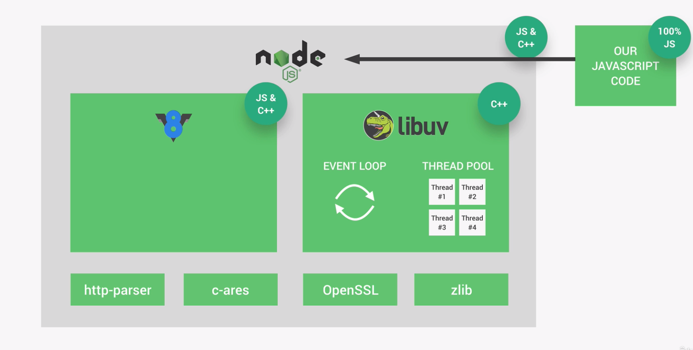
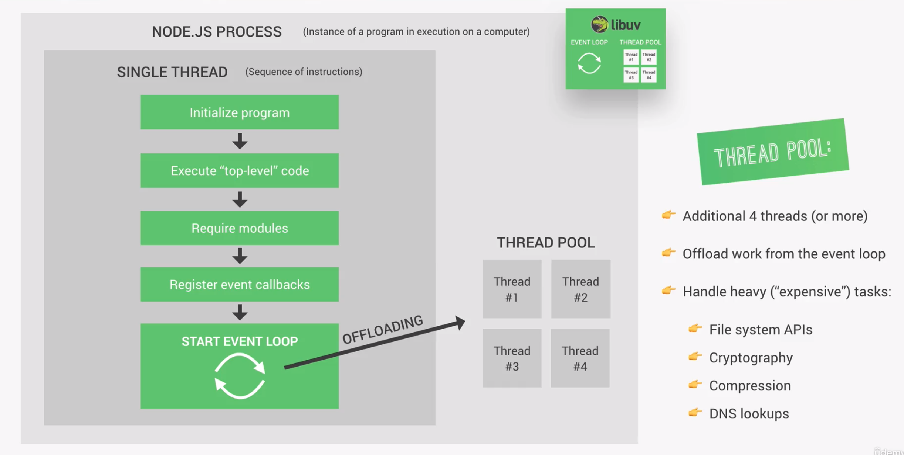

# Behind The Scenes: NodeJS

Behind the scenes NodeJs uses several dependencies, of which the most important ones are Google's V8 engine and libuv.

The V8 engine is the heart of every Javascript runtime, since it converts Javascript code into machine code.

Libuv on the other hand is an open-source library with a strong focus on asynchronous IO. This gives NodeJs access to the underlying computer operating system, file system, networking and more. Besides that Libuv implements two extremely important features of NodeJs, which are the event loop and the thread pool. The event loop of NodeJS is similar to the event loop in the browser's runtime: It is respinsible for handling easy tasks like executing callbacks and network IO. The thread pool is responsible for more heavy work like file access or compression of files.

It is important to note that libuv is actually written in C++ and offers a great layer of abstraction so that we can access to functions in pure Javascript.

Besides V8 and libuv, NodeJs relies on other dependencies for example http-parser, for parsing http, c-ares for DNS related functionality, OpenSSL for cryptopgraphy and zlib for compression.



## Node Process And Threads

When we use Node on our computer it means that a node process is running, the process being a program in execution. This is important to mention because we can have access to something called a process variable, which will be covered later.

When starting our node application, the program is initialized, followed by the execution of the top-level code, so any code that is not inside of a callback function. It requires all the modules and registers event callbacks before starting the event loop.

The event loop is the place where most of the work si done in our application. But since NodeJS relies on the V8 engine, it runs on a single thread and is prone to blocking behaviour.

This is why the thread pool is introduced, which out-sources the heavy load work, like compression, cryptography, DNS look-ups and every task related to the file system. The thread pool gives us four additional threads, which are completety seperated from the main single thread. The thread pool can be configured to have up to 128 threads. We can do this by accessing the a process environment variable as follows:

```js
process.env.UV_THREADPOOL_SIZE = x;
```

It is important to note that which tasks are given to the thread pool is not a decision made by the developers, but happens automatically behind the scenes.


