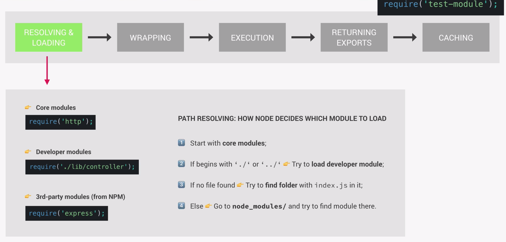
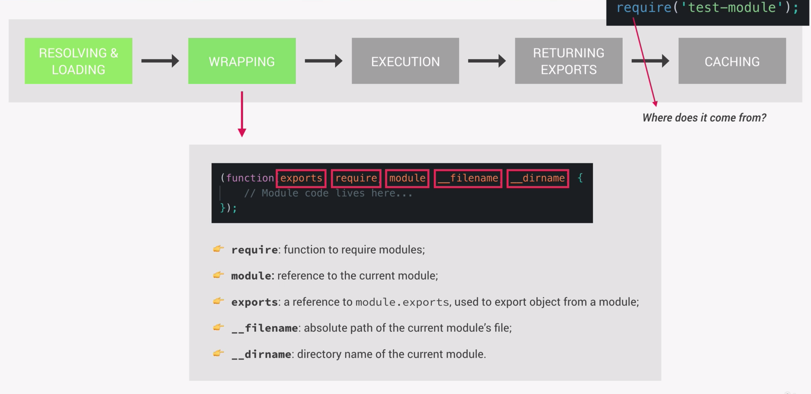
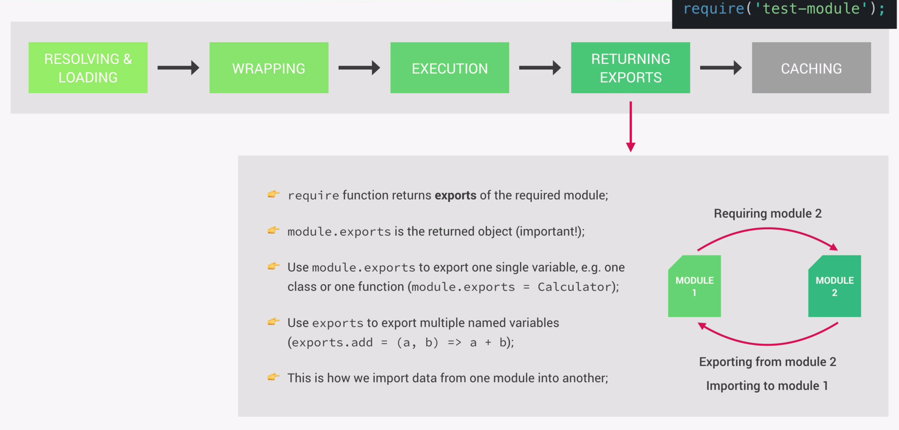

# How Requiring Modules Works

In the node.js module system each Javascript file is treated as a separate module. When we use require to import functions and export data, we make use of the CommonJS module system, which is the original module system node uses. In addition to that there is also the ES module system, which was developed to work in the browser using the import export syntax. By default node is using the CommonJS module system, but at this point it is also possible to use the ES module system, for example by adding "type":"module" to the package.json file.

#### What happens when we require a module

As a borad overview the following steps are executed behind the scenes:

##### 1. Resolving the path and loading the module

We can load three different kind of modules: our own modules, third party modules or node's core modules. When the require function receives the module name as its argument, it will first try to load a node core module with that name. If pass in a path this means we want to load our own custom module. If no module can be found via these two methods, node will look for the folder in which the index.js file sits and then look inside the node_modules folder for the respective module.



##### 2. Wrapping

After the module is loaded it is wrapped in a function, a IIFE to be precise, which gives us access to the exports, require, module, **filename and **dirname objects. This is why every module automatically has access to the require function for example.
By doing this node acheives access for the developers to the above-mentioned variables, but it also keeps top-level variables of our imported modules private. This means the global variables of the module are scoped to the module. This is crucial for the functionality for the entire app to work.



##### 3. Execution

In the next step the code inside the module's wrapper function is executed by the NodeJS runtime

##### 4. Returning exports

In this step it's time for the require function to return somethin, which is the exports if the required module. these exports are stored in the module.exports object.



##### 5. Caching

In the last step modules are actually cached after the first time they have been loaded. This means that if you require the same module multiple times you will always get the same result. Also the code in the modules is only executed in the first call. In subsequent calls the result is simply retrieved from cache.

#### How to use module.import/export

There are different ways to import and export our own modules.
If we want to export a single value we can use one of following methods:

Method 1:

```js
function Calculator(a,b) {...}

module.exports = Calculator
```

Method 2:

```js
module.exports = function(a,b) {...}
```

**Importing:**

```js
const calculator = require("<path-of-module>");
```

Another way is to directly add properties to the exports objects which hold our functions for example. We assign the anonymous function directly to the property. We can access the functions from the imported object via the dot method.

```js
exports.add = (a, b) => a + b;
exports.multiply = (a, b) => a * b;
exports.divide = (a, b) => a / b;
```

**Importing:**

```js
const { add, multiply, divide } = require("<path-of-module>");
```
