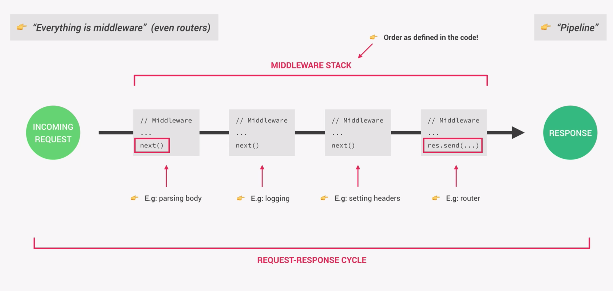

# Middleware

In order to start the request-response cylce, our express app receives a request when someone hits the server, which reacts by creating a request and response object. This data will be used and processed in order to generate and send back a meaningful response. In order to process the data we use something called **middleware**, which can manipulate the request and response object. But middleware does not always have to be about the request and response object, but it can also execute any other code we like. But usually it is mostly about the request. It is called middleware because it is a function which is executed in between or in the middle of receiving the request and sending the response.
In Express we can go so far to say that everything is middleware.

All the middleware that is used in our app is called the middleware stack. It is important to remember that the order in which middleware is executed is the exact same order in which middleware is defined our code. This means that a middleware function that appears first in the code is executed before another middleware function that appears later. That is the reason why the order in which code is written in Express is very important.

Now, our request response object will be passed through each middleware function where it is processed or some other code is executed. At the end of each middleware the next function is invoked, which is a function which is available in every middleware function. Next() passes the processed request response object to the next middleware function. This happens with all the middleware until we reach the last one in the stack. The last middleware function in the stack is usually a route handler. In this handler we do not call the next function to move to the next middleware. Instead, we finally send the response data back to the client.

With all these steps fulfilled, we end the so called **request-response cycle**.

