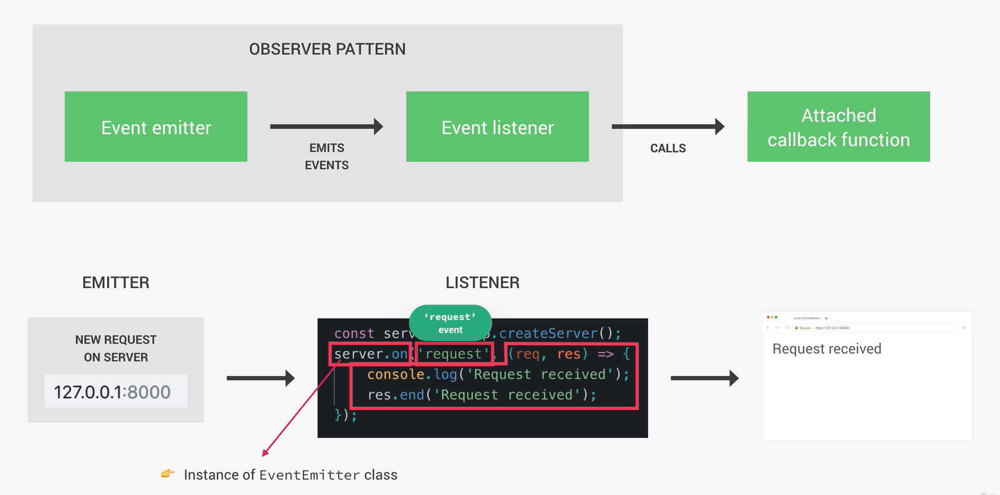

## Event-Driven Architecture

Most of Node's core modules, like HTTP, fs and timers, are built around an event-driven architecture. Node provides certain objects called event emitters, which emit named events as soon as something important happens, like a request arriving at the server, a file is finished being read or a timer expiring. These events can be picked up by event listeners which are set up by the developer and which fire off callback functions that are attached to each listener.

To illustrate let's take a server request in the HTTP module:
We crete a server using the createServer method and save it in a variable. We then create a listener with the server.on method, which reacts to the request event. The server acts as an emitter, whenever an request was made, and will automatically emit an event called 'request'. This event is picked up by our event listener and the callbackfunction that we attached to it will be invoked.

This behaviour is possible because the server object is actually an instance of the NodeJS eventEmitter class. It inherits all this functionalities from it.

This eventEmitter logic is called the observer pattern and is a general pattern used in Javascript. The idea is that an observer (event listener) keeips waiting and observing the subject which will eventually emit the event that the listener is waiting for. The observer pattern was designed to react rather than to call.



## Event Emitters in Practice

In order to use event emitters, we need to require the events module first. We can then simply create a new instance of the EventEmitter class using the new keyword and storing it in another variable.

It is a good practice to extend from the EventEmitter class and create a new class for this purpose. This is why we create the Sales class.

With the emit method we generate the emit event, which is comparable to the event when a button is clicked on an eventListener in the DOM. We can then name the emit event.

When setting up a listener, in this case with the on method which is comparable to onClick if the emit event would be a button click, we first put the name of the event as a string and attach our callback function, which we want to execcute when the event occurs.

Additionally we can pass arguments to the eventLstener by passing them as an addtional argument in the emitter. In this case pass in the number 9, which is why the eventListener gets access to that value.

```js
const EventEmitter = require("events");

class Sales extends EventEmitter {
  contructor() {
    super();
  }
}
const myEmitter = new Sales();

myEmitter.on("newSale", () => {
  console.log("There was a new sale!");
});

myEmitter.on("newSale", () => {
  console.log("Costumer name: Max");
});

myEmitter.on("newSale", (stock) => {
  console.log(`There are ${stock} items left in stock.`);
});

myEmitter.emit("newSale", 9);
```

Of course we do not always have to emit events on our own, but can access built-in events that are emitted when something happens.

In this example we create an http server and listen for the request and close event. So everytime a request is made the attached callback is executed in the eventListener.

It is important to note that in this example we see the console.logs appear twice. This is because with every request event the browser automatically tries to request a favicon icon. So one log is for the actual root and the other for the favicon.

```js
const server = http.createServer();

server.on("request", (req, res) => {
  console.log("Request received!");
});

server.on("close", (req, res) => {
  console.log("Server closed!");
});

server.listen(8000, "127.0.0.1", () => {
  console.log("Listening on port 8000...");
});
```
