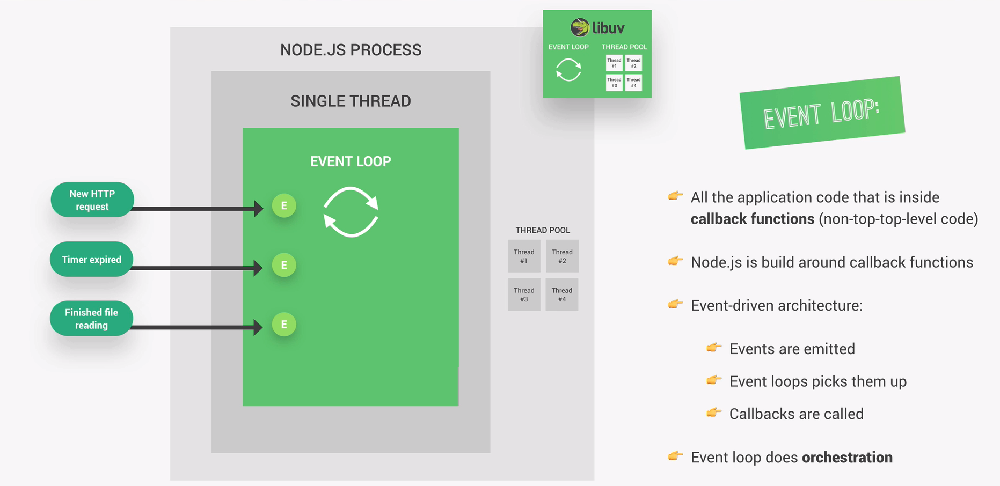
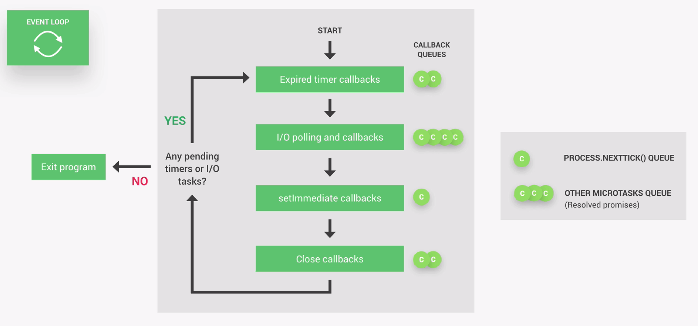

## The Event Loop

The event loop is the heart of the node architecture. It is the place where all of the code that is inside of an callback function will be executed, which basically is all of the code that is not top-level code. Some heavy tasks might be offloaded into the thread pool, but it is still the event loop which takes care of this.

NodeJS is built around callback functions, meaning functions that are called as soon as some work is finished in the future. This works because Node uses an event-driven architecture. Actions like receiving an HTTP request, a timer expiring or files finished being read, will emit events as soon as they are completed. The event loop will pick up the events and call the callback functions which are associated with the respective event. Therefore the event loop can be seen as the orchestrator, who receives events, calls their callback functions and offloads more expensive tasks to the thread pool.

#### How the event loop works: The four phases

The event loop has multiple phases, in which each phase has its own callback queue, where the callbacks associated with the events are located. Callbacks in each queue are processed one by one until there are none left in the queue, and only then, the event loop will enter the next phase.

The most important phases are the following:

1. **Phase 1: Timers**
   The first phase takes care of callbacks of expired timers, for example from the setTimeout function. If there are callback functions from timers that just expired, these are the first ones to be processed by the event loop. If a timer expires later while the event loop is in another phase, the callback of that timer will only be calles as soons as the event loop comes back to te first phase.

2. **Phase 2: I/O polling**
   In this phase the event loop is looking for new I/O events that are ready to be processed. I/O mainly means actions like networking and file access and it is where probably most of our code gets executed, siply because in a typical node app, the bulk of what we need to do is related to networking and file accessing.

3. **Phase 3: setimmediate callbacks**
   setImmediate is a special kind of timer that we can use if we want to process callbacks immediately after the I/O polling and execution, which can be important in some more advanced use cases.

4. **Phase 4: Close callbacks**
   In this phase all close events are being processed, for example for when a web server or a web socket shut down.

Besides these for main phases and callback queues, there are also two other special queues, which are the nextTick and the microtasks queue. These callback queues are treated differently, since if there are any callbacks in one of their queues, they will be executed right after the current phase of the event loop instead of waiting for the entire loop to finish and start again.

While the microtasks queue is reserved for promoises, nextTick is a function that we can use when we really need to execute a certain callback right after the current event loop phase. It is similar to the setImmediate function, with the difference that setImmediate only runs after the I/O polling. The name of nextTick can be misleading though, because a tick is actually a whole event loop cycle. But nextTick will not be start a new cycle but its callback function simply will be executed before the start of the next loop phase.

One cycle of the event loop is called a tick. After the a cycle finished it is time to decide whether the loop should continue to the next tick or if the program should exit. Node does this by checking whether there are any timers or I/O tasks are running in the background. If there are not any, the program will exit, otherwise it will continue to the next tick. For example, if we are listening to incoming HTTP requests with server.listen, which is basically an I/O task, the event loop will notice and instead of exiting it starts the event cycle all over again.

#### Summary

In a nutshell, the event loop is what makes asynchronous programming possible in NodeJS and therefore making it the most important feature in Node's design. It takes care of all incoming events and performs orchetration by offloading heavier tasks into the thread pool while doing the easier work itself. We need the event loop because Node runs in one single thread, which makes node lightweight and scalable, but at the same time comes with the risk of blocking behaviour. In other languages like PHP running on an Apache server, a new thread is created for each new user, which makes it way more resource-intensive, but on the other hand there is no risk of blocking behaviour.

It is the developers responsibility to not block the event loop. Some basic guidelines for doing is are:

1. **Do not use sync versions of functions in the fs, crypto or zlib modules inside your callback functions.**
   It is okay in the top-level code, though.
    
2. **Do not perform complex calculations in the event loop**
    
3. **Caution with JSON in large objects**
   It might take a lot of effort and time to parse or stringify JSON
    
4. **Do not use too complex regular expressions (especially nested quantifiers)**

There are some potential solutions to these blocking problems, like manually offloading to the thread pool or using child processes, but they belong to the more advanced techniques.
