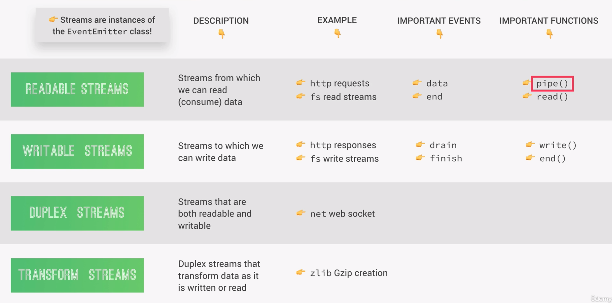

# Streams

Streams allow us to process data in smaller chunks, wouthout completing the whole read or write operation, and therefore without keeping all the data in memory. Instead of waiting until the entire video file loads, the processing is done piece by piece, so that you for example watch a video file before the entire file has been downloaded.

Streams are the perfect candidate for handling large volumes of data or data we are receiving in chunks from an external source.

Additionally, streaming makes the data processing more efficient in terms of memory because there is no need to keep all the data in memory, and also in terms of time, since we can start processing the data as it arrives.

## Implementation of Streams in Node

Node offers four fundamental types of streams, which are readable, writable, duplex and transform, while readable and writable streams being the most important ones.

Duplex streams are readable and writable at the same time and are a little bit less common. An example where duplex streams are used are web sockets from the net module, a web socket being a communication channel between client and server, which works in both directions and stays open once the connection has been established.

Transform streams basically are duplex streams which can modify or transform data as it is read or written. A good example for this is the zlib core module, which is used to compress data.

Streams exist everywhere in the Node modules. For example the data that comes from an http server's get request is actually a readable stream. We can also read a file from the file system with createReadStream, which can come in handy if we are dealing with very large text files for example.

In node, streams are instances of the eventEmitter class, which means that all streams can emit and listen to named events.

Finally, besides events, we have also access to important functions that we can use when working with streams.



## Streams in Practice

In the following example we go through three different ways how to read a large text file from the file system and then send it to the client.

##### 1. Basic solution: Read the file into a variable and send it to the client.

The problem with this solution is that node needs to load the entire file into memory, because only after that it can start sending the data. It becomes an even bigger problem the bigger the file is or also when there are large amountsof requests hitting your server, because the node process will quickly run out of ressources.

This is solution works locally for ourselves or for very small files, but not in a production-ready application.

```js
const fs = require("fs");
const server = require("http").createServer();

server.on("request", (req, res) => {
  fs.readFile("test-file.txt", (err, data) => {
    if (err) console.log(err);
    res.end(data);
  });
});
server.listen(5000, 127.0.0.1, () => console.log('Listening...'))
```

##### 2. Using streams

Instead of reading the data into a variable and having to store that variable in memory, we can create a readable stream. As we receive each chunk of data, we directly send it to the client as a response using a writable stream.

We create a readableStream with the createReadStream method from the fs module. Each time there is a new piece of data for us to consume, the readable stream will emit the data event, which we can listen to. Inside the callback of the eventListener we can create a writable stream with that chunk of data, which we send to the client as a response.

Finally we have to handle the event when all of the data finished being read. In that case the end event will be emitted, which we will listen to and end the stream with res.end. This shows we that we can use res.end to send data when it is passed into the method, or simply end a writable stream when no arguments are passed to it.

Another important event is the error even in which we have access to the error object, which we can listen to and act accordingly in case an error appears.

```js
server.on("request", (req, res) => {
  const readable = fs.createReadStream("test-file.txt");
  readable.on("data", (chunk) => {
    res.write(chunk);
  });
  readable.on("end", (req, res) => {
    res.end();
  });
  readable.on("error", (error) => {
    console.log(error);
    res.statusCode = 500;
    res.end("File not found");
  });
});
```

#### The problem with the second approach: Backpressure

The problem with using the aforementioned approach is that our readable stream we are using to read the file from the disk is much faster than sending the data via the writeable stream. This will eventually overwhelm the response stream, because it cannot handle all the incoming data fast enough. This behaviour is called backpressure. In other words backpressure happens when the response cannot send the data nearly as fast as it is receiving it.

This leads us to the final solution:

#### Best solution: pipe()

To fix the above-mentioned problem we can make us of the pipe method. Pipe is available on all readable streams an it allows us to connect the output of a readable stream right to the input of a writable stream. Thus the speed is automatically handled based on the speed of the data coming in and the data going out.

This makes the third solution the most elegant and easiest one for this case. Behind the scenes it does something like we did in the second approach, but it offers a great level of abstraction and fixes the problem of backpressure.

```js
server.on("request", (req, res) => {
  const readable = fs.createReadStream("test-file.txt");
  readable.pipe(res);
});
```
