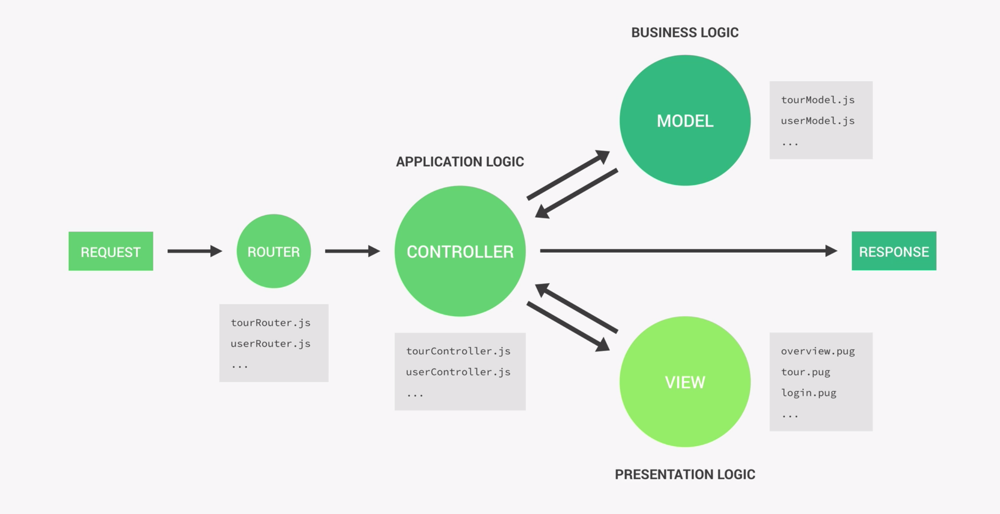

# MVC architecture

MVC, which stands for Model, View, Controller, is a widely used and well known architecture. MVC can be implemented in a several different ways, our example being the most straigthforward.

In this architecture the model layer is about anything related to application data and **business logic**.

The purpose of the controller layer is to handle the applications request, interact with models and send back responses to the client. All of this is called the **application logic**.

One of the big goals of MVC is to separate business logic from application logic. When we dive deeper into the meaning of these porpositions, we find that that the explanations can be quite different. One explanation could be:

1. Application Logic: This logic refers to all the code that is only concerned with the application's implementation and not the underlying business problem, we are trying to solve with the application. It is basically the logic that makes the app work, for example managing requests and responses. The application logic also serves as a brdige between the model and view layers.

2. Business Logic: This logic refers to all the code that solves the business problem or is direcctly related to business rules or how the business works. If our goal is to show and sell tours, then the code is directly related to creating tours in the database, checking if a user's password is correct, validating user input data or ensuring that only users who bought a certain tour can review it.

It is important to note that application and business logic often times cannot be completely separated and will overlap.

A motto regarding the relationship between application and business logic is:

> _Fat Models/Thin Controllers: offload as amuch logic as possible into the models, and keep the controllers as simple and lean as possible_

The view layer is necessary if we have a graphical interface in our app. If we are building a server-side rendered website, the view layer would consist of the templats used to generate the UI, meaning the website that we are going to send back to the client. This layer deals with the so called **presentation logic**.

Using a pattern or architecture like this allows us to write amore modular application, which is going the be easier to maintain in scale.

#### Example:

In case of the natours application the flow would be something like this. An incoming request hits the server and the first thing it encounters is the router. The router will pass the request along the right path to the controller which is responsible for the request. Based on the type of request, the controller now sends or retrieves from the database which sits in the model layer. It can then send back the data to the client as a response. If we are using server-side rendering, a respective controller will get the corresponding view templates from the view layer, process them and send the final response to the client.
