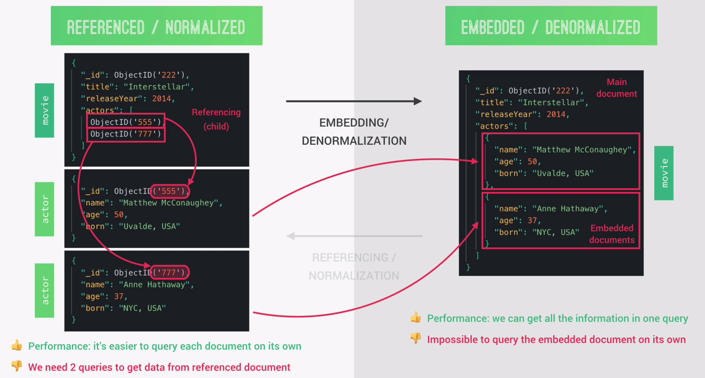
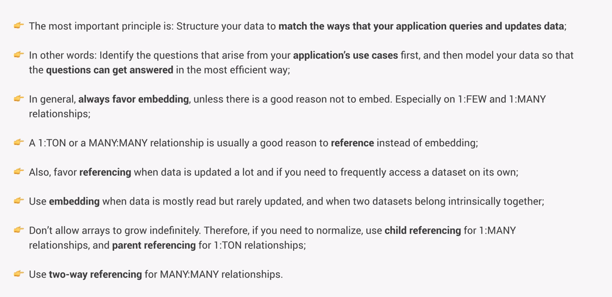

# Data Modeling And Relationships

Data modeling is the process of taking unstructured data generated by a real world scenario and structuring it into a logical data model in a database, reflecting the real-world relationships that exist between some of the datasets.

## 1. Types of relationships between data

We can diffentiate between three big types of relationships that can exist between data: one-to-one, one-to-many and many-to-many. A one-to-one relationship is established when one field can have only one value.

A one-to-many relationship can be divided further into three sub-types, depending on the relative amount of 'many'. In relational databases only one-to-many is actually defined, without qunatifying how much 'many' actually is. But it is still an extremely important factor when deciding if we should denormalize or normalize data, as we will do a bit later, especially in a non-relational database like mongoDB.

The main difference of the many-to-many relationship is that it is bi-directional, while the other two are only one-directional. So for example a movie can have many actors, but an actor could have played in many movies as well.

## 2. Referencing vs. Embedding

Each time we have two related datasets we can either represent that related data in a reference(normalized from) or in an embedded/denormalized form.

In a referenced form two related datasets and documents are separated. In this example we keep actors and movies separated and reference the actors using their ID. This is also called child referencing because the parent document (movie) is referencing its children (actors).

In a relational database all data is always represented in a normalized form. But in a non-relational database like mongoDB we can denormalize data into a denormalized form by simply embedding the related document right into the main document where it needs to be referenced. This gets rid of the need of separate documents, collections and IDs and will result in fewer queries that our application needs to send to the database, because we can get all the data at the same time. This in turn will ultimately result in better performance. The downside of embedded documents is that we cannot query the embedded data on its own. The exact opposite is true for normalized data.

## 3. Decision-making

The following framework can help with making the right decision when it comes to decide for an embedded or referencing form. It is important to combine all 3 critera, as a single criteria be decisive. For example the relationship between movies and images might tend to be an embedded one, but if we want to implement a movie quiz in our application for example, the last criteria determines the form as we would frequently would query the images on their own.

Remember that there are no hard rules when it comes to choosing a form. But thinking about planning about those kind of things, can help us find an optimal solution, which often times greatly affects the performance of our application.

## 4. Types of referencing

Let us now assume that we have chosen to normalize our datasets. This confronts us with the question which type of referencing we want to choose as there are three main types of referencing.

1. Child-referencing
2. Parent-referencing
3. Two-way-referencing

#### Child-referencing

In child-referencing we keep references to the related child documents in the parent document, where they are usually stored in an array. The problem which arises is that this array might become very large, imagine millions of logs for example. This is an anti-pattern in mongoDB, which we should avoid at all costs. Also keep in mind that there is an 16 megabyte limit for documents, which easily can be exceeded having to many references in this array.

Generally speaking child-referencing is best used for one-to-few relationships, where we know beforehand that the reference array will be limited to a small amount.

#### Parent-referencing

Parent-referncing presents itself as the opposite of child-referencing, as in each child document a reference to the parent document is kept. This can be good for one-to-tons relationships where the 'tons' component may become indefinitely large. Also, we avoid having an every growing reference array in the parent document. The children can be seen as more stand-alone, but also more isolated and the parent element does not even know of their existance.

Generally speaking parent-referencing is best used for one-to-many and one-to-ton relationships.

#### Two-way-referencing

In two-way-referencing we keep references of the relational data in both related documents to accomodate to the bi-directional flow of many-to-many relationships, where this type of referencing is most commonly used.

## 5. Summary and Tips

