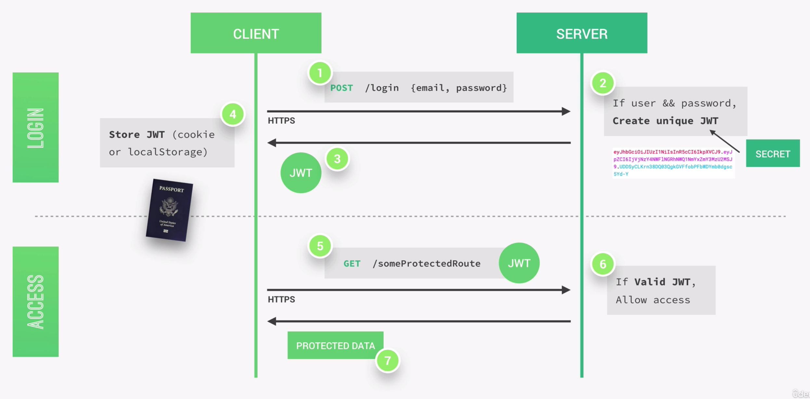
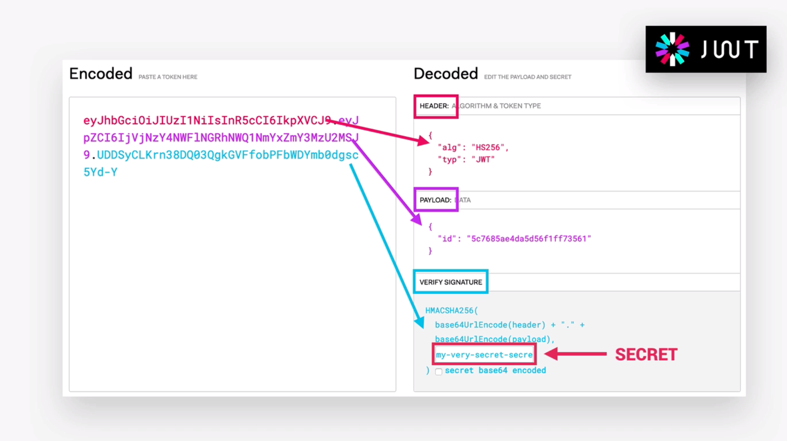
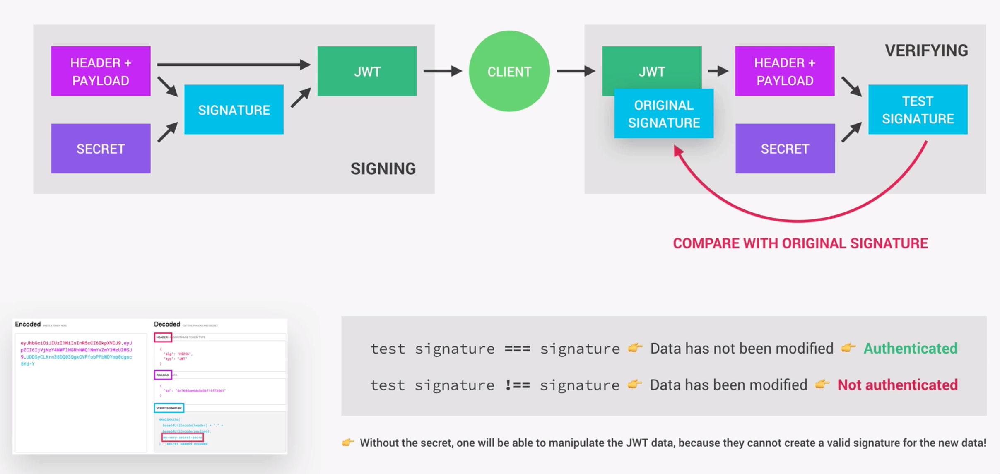

# JSON Web Tokens: JWT

There are many authentication methods out there, but the one we are using is a stateless solution called JSON Web Tokens(JWT). There is no need to store any session state on the server, which is perfect for restful APIs, which should always be stateless. A widely used alternative to JWT is to store the user's log-in state on the server using sessions.

A JWT is like a passport to access protected parts of the application. Assuming we already have registtered user inour database, the user's client starts by making a post request with the username/email and the password. The application then checks if the user exists and the password is correct, then a JWT for only that user is created using a secret string that is stored on the server. A JWT is basically just a string, which is sent back to the client, who will store it either in a cookie or local storage. The server does in fact not know which users are currently logged into our application, leaving no state on the server. Storing the secret key on the server does not make the process stateful, because stateful would mean that the server has to remember information about the previous request, which is not the case.

Each time the client wants to access a protected route, like his user profile, he sends his JWT along with the request to the server. The application running on our server will then verify if the JWT is valid. If so, it will send back the requested data. Otherwise an error message will be sent. As long is the user logged in this is how it is going to work each time that the user request data from a protected route.

It is important to note that all this communication needs to happen over a secured https connection in order to prevent anyone from gaining access to passwords or tokens.

## What JWT Looks Like

A JWT essentialy is an encoding string made up of three parts:

Encoded, but not encrypted:

1. Header: Holds metadata about the token itself
2. Payload: Holds the data that we can encode

Encoded and encrypted:

3. Signature: Created using header, payload and secret from server and holds sensitive data

The first two parts are just plain text that will get envoded but not encrypted. This means that anyone can decode and read them, which is why we cannot store any sensitive data in them.

Storing sensitive data is the job of the signature, which is created using the header, the payload and the secret that is stored on the server. This whole process is called signing the JSON Web Token.

Once the server receives A JWT to grant access to a protected route, it needs to verify it in order to dermine if the user really is who he claims to be. This verification setp will check that no third party altered either the header ot he payload of the JWT. As soon as the JWT is received, the verification will take its header, payload and secret and create a test signature. This test signature can now be compared to the originial signature stored in the incoming JWT.

If the the test signature is the same as the original signature then this means that the payload and the header have not been modified, so we can safely authenticate the user.

Without the secret stored on the server, no one will be able to manipulate the JWT data, because they cannot create a valid signature for the new data. SOmeone could manipulate the data of course, but it will always fail during verification.

