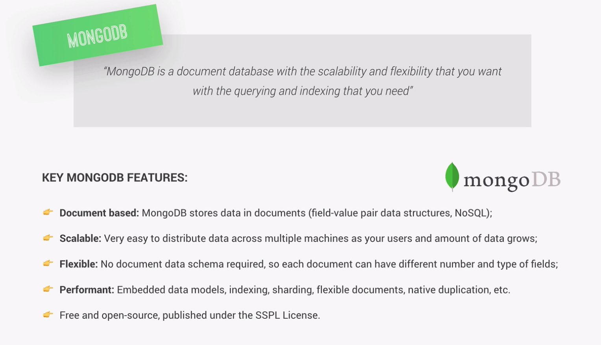
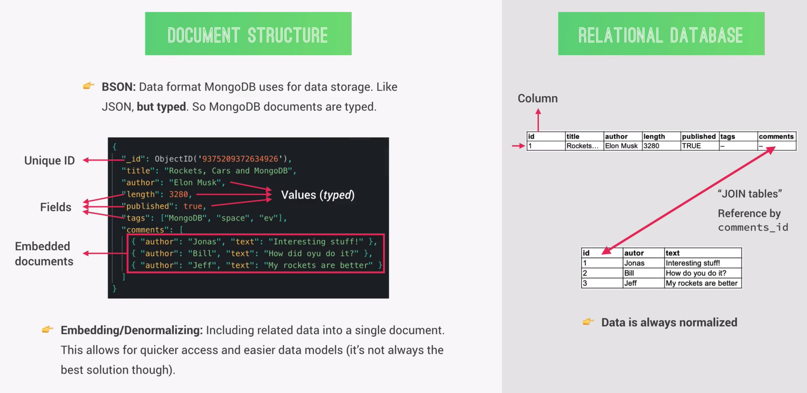

# MongoDB: Overview

MongoDB is a so called NoSQL database. In Mongo each database can contain one or more collections, which we can also think of as a table of data. Each collection can contain one or more data structures, called documents. Each document would represent a row in a table in a relational database.

#### Key MongoDB Features:

MongoDB uses a data format similar to JSON called BSON, the difference being that BSON is typed, meaning that all values need to have a data type assigned, like string, boolean, number etc. The maximum size for each document in the BSON format is currently 16MB, but it might increase in the future.

#### Comparison with Relational Databases

Each document in mongoDB can be compared to a row in a relational database, while each field-value pair could represent a column.

Each document contains a unique ID, which acts as a primary key for that document. It is automatically generated in the object ID data type for every document, so we do not have to worry about IDs.

A big difference to relational database is that we do not need to predefine the schema for the data, each document can have varying fields and types.

We can also have mutliple values in one field, which is not allowed in realtional databases.

Another key difference is the possibility to embed or de-normalize data, which means we can include related data into a single dcoument. In the comments field in the figure, we have an array which contains three objects, which also could be separate documents on their own. In mongoDB it is possible to embed these three documents right into another document. This makes the database more performant in some situatuins, because in this way it can be easier tor ead all the related data we need at once.

The opposite of of embedding or de-normalizing is called normalizing, and it is the way of modelling data in relational databases. Since it is not possible to embed data, the solution is to to create a whole new table for the each comment in the comments array and then join the tables by referencing to the ID filed of the comments table.

## Mongoose

Mongoose is an Object Data Modeling (ODM) library for MongoDB and Node.js. It offers a higher level of abstraction and is comparable to the relationship of NodeJS and Express.js.

An ODM library offers developers the ability to write Javascript, which will then interact with a database.

Some of the features Mongoose offers are:

1. Schemas to model data and relationships
2. easy data validation
3. simple query API
4. middleware
   and much more...

In Mongoose a schema is where we model our data, meaning where we describe the structure of the data, default values and validation. We then take the schema and create a model out of it. A model functions as a wrapper around the schema, which allows to actually interface with the database in order to to CRUD operations. It is like a blueprint that we use to create documents. It is comparable to classes in Javascript, which we use to build some sort of structure or a blueprint for to be created objects.
