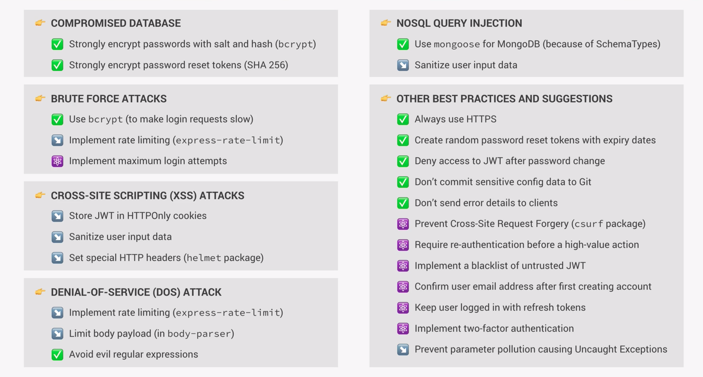

# Security Best Practices



## XSS-Attacks

### Storing JSON Web Token in HTTPOnly cookie

A good way to protect your application from XSS attacks is to store and send the JWT in http only cookie. A cookie basically is just a small piece of text a server can send to the client. When the client receives a cookie, it will automatically store it and send it back along with all future requests to the same server.

In order to create a cookie, we simply attach it to our response. The cookie method takes three arguments, the first one being the name, the second the data we want to send and the third one an options object. We name our cookie 'jwt', send the token data with it and sperately define three options.

At first we want to add an expiration date after which the cookie is no longee valid. A good place to store information about the duration is the .config.env file. In there we set it to 90, so we do some calculations to set it to 90 days in the expires property.

Next we set httpOnly to true, which means that the cookie cannot be acccessed or modified in any way by the browser. This is important in order to prevent cross-site scripting attacks(XXS).

Lastly we want to set the secure option to true, which means that the cookie only will be sent on an encrypted connection (https). In this example we also account for the the fact that in development we often use an insecure connection. This is why we set the secure option to be true only when we are in our production environment.

```js
const createSendToken = (user, statusCode, res) => {
  const token = signToken(user._id);

  const cookieOptions = {
    expires: new Date(
      Date.now() + process.env.JWT_COOKIE_EXPIRES_IN * 24 * 60 * 60 * 1000
    ),
    httpOnly: true,
  };
  if (process.env.NODE_ENV === "production") cookieOptions.secure = true;

  res.cookie("jwt", token, cookieOptions);

  // Remove the password form the output
  user.password = undefined;

  res.status(statusCode).json({
    status: "success",
    token,
    data: {
      user,
    },
  });
};
```

### Setting security HPP headers

In order to set hpp headers we need to install a package called 'helmet'. Helmet is in fact a colection if multiple middlewares, 14 to be precise. Some of them are active by default and if we feel the need to activate others we can simply do that by looking at the documentation. The implementation could not be any easier, we simply need to set up helmet as a global middleware function. It is recommended to use helmet early in your middleware stack.

```js
app.use(helmet());
```

## XXS-Attacks / NoSQL Query Injection

### Data Sanitization

Data sanitization helps us to clean incoming data from malicious code.

#### Protection against NoSQL Query Injection

It is fairly easy to be able to log in with just a password without knowing the email address. A query injection could look like this:

```json
{
  "email": { "$gt": "" },
  "password": "<correct password here>"
}
```

This works, because all the users match the query, saying the email value should be greater than an empty string. When typing this in our mongoDB database, all the users will be returned. The statement will always return true and is a valid query, which allows the attacker to log in with only a valid password.

In order to defend our application against such kinds of attacks we need to install a package called <code>express-mongo-sanitize</code>, because express does not come with those security features out of the box. For most cases it is enough to create a middleware function from the mongoSanitize function.

MongoSanitize works by looking at the request body, query string and params and filtering out all the $-signs and dots, which is how mongoDB operators are written.

```js
app.use(mongoSanitize());
```

#### Protection against XXS-Attacks

In order to protect ourselves against malicious code injections, we can use a pacakge called <code>xxs</code> to sanitize incoming data and remove those code snippets. Using this middleware we are basically converting all HTML symbols so they cannot be activated when injected in our code. Apart from that mongoose's validation already is a good protection against those kind of attacks, at least on the server side. This is because we only allow certain datatypes for example to be entered in our database.

```js
// This middleware will clean any user input from malicious html code.
app.use(xss());
```

## Denial of Service/ Brute Force Attacks

### Implementing rate-limiting

Rate-limiting helps us to protect our application from denial of service or brute force attacks. A rate limiter will count the number of requests coming from one IP and if a certain threshold is exceeded will block any further requests for a period of time.

A good way to implement this is as a global middleware. First we need to import a package called <code>express-rate-limit</code>. We create a limiter with the calling the rateLimit function and passing in an object of options. In there we can set the maximum number of allowed requests and also set the time window which defines the time in miliseconds until a blocked IP is allowed to make requests again. We can also set a custom error message.

Additionally we can specify the limiter just for a certain route, in our case everything which is realted to our /api route.

```js
const rateLimit = require("express-rate-limit");
// Limit request from same API
const limiter = rateLimit({
  // max number of requests
  max: 100,
  // time window set to 100
  windowMs: 60 * 60 * 1000,
  message: "Too many requests from this IP, please try again in 1 hour",
});
// Apply limiter only to api routes
app.use("/api", limiter);
```

### Limit body paylod

In order to protect against denial of service attacks we can limit the amount of data that is allowed in our request body. For that we simply need to add an option to the body parser (express.json()) and set the limit option to a certain amount of data. In our case we set it to 10kilobytes.

```js
app.use(express.json({ limit: "10kb" }));
```

## Other Best Practices

### Prevent Parameter Pollution

Preventing parameter pollution gets rid of error when using multiple sort queries for example in our query string and only takes the last sorting statement. We need this because in our apiFeatures.js we defined that the queryString.sort should be a string, since we use the split method on it. Having multiple sort queries will return an array which is not ideal in our case. At the same time we want to be able to filter by other multiple queries for example duration. This is why we need to whitelist the fields in the hpp middleware for which we want to enable this functionality.

The package needed for this is called <code>hpp</code> which stands for HTTP Parameter Pollution.

```js
// Inside apiFeatures.js
  filter() {
    const queryObj = { ...this.queryString };
    const excludedFields = ['page', 'sort', 'limit', 'fields'];
    excludedFields.forEach((el) => delete queryObj[el]);

    let queryStr = JSON.stringify(queryObj);
    queryStr = queryStr.replace(/\b(gte|gt|lte|lt)\b/g, (match) => `$${match}`);

    this.query = this.query.find(JSON.parse(queryStr));
    // Return the entire object in order for chaining methods to work
    return this;
  }

  sort() {
    if (this.queryString.sort) {
      const sortBy = this.queryString.sort.split(',').join(' ');
      this.query = this.query.sort(sortBy);
    } else {
      this.query = this.query.sort('-createdAt');
    }
    return this;
  }

// Inside app.js

app.use(
  hpp({
    whitelist: [
      'duration',
      'ratingsQuantity',
      'ratingsAverage',
      'maxGroupSize',
      'difficulty',
      'price',
    ],
  })
);
```
