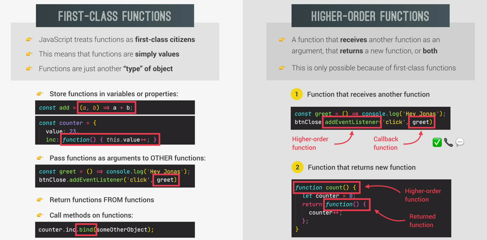

# First-Class vs. Higher-Order functions

Javascript differentiates between first-class functions and higher-order functions. Since functions are just other types of objects and objects are treated like values, functions are also treated just like values. We say that Javascript treats functions as first-class citizens. This allows us store functions into variables, create methods in objects and do all the things that we can do with values.

This behaviour allows us to create higher-order functions, which take other functions as an argument or return a function or both. The function passed to a higher-order function is often referred to as callback function. We can create our own higher order function or use the numerous built in ones like array.prototype.map.

In practice, first-class functions is a feature of Javascript, meaning the the concept that functions are treated just like a value.
There are, however, higher-order functions in practice, which are possible, because the language supports first-class functions.



## Creating own higher-order functions

In this example we create two functions. The first transforms a string into one word, the second one capitalizes the first word of a string.

We then create a higher order function, which takes a string and a callback function as an argument. Inside this function we can transform the string by whatever function we pass in. So when calling the transformer function we can easily transform a string to either one lower case string or capitalize the first word.

Inside the function we can also log the name property of the function with fn.name.

```javascript

const oneWord = function(str) {
    return str.replaceAll(' ', '').toLowerCase();
} 

const upperFirstWord = function(str) {
    const [first, ...others] = str.split(' ');
    return [first.toUpperCase(), ...others].join(' ');
}

//Higher-order function
const transformer = function(str, fn) {
    console.log(`Transformed string: ${fn(str)}`);

    console.log(`Transformed by: ${fn.name}`);
}

transformer('Javascript is fun', upperFirstWord)

transformer('Javascript is fun', oneWord)

```

## Callback functions

Callback functions are frequently used in Javascript. They help us split up our code into several parts, which then can be reused and interconnected.
The second and way more important advantage is, that callback functions allow us to make abstractions. Abstraction basically means hiding the detail of some code implementation and showing only the essential features. For example the transformer function is only concerned with transforming a string, but does not care how it is actually done. It is delegating the process to a lower level of function. This is why it is called a higher order function, because it operatres on a higher level of abstaction, leaving the low level details to the "low-level" functions.