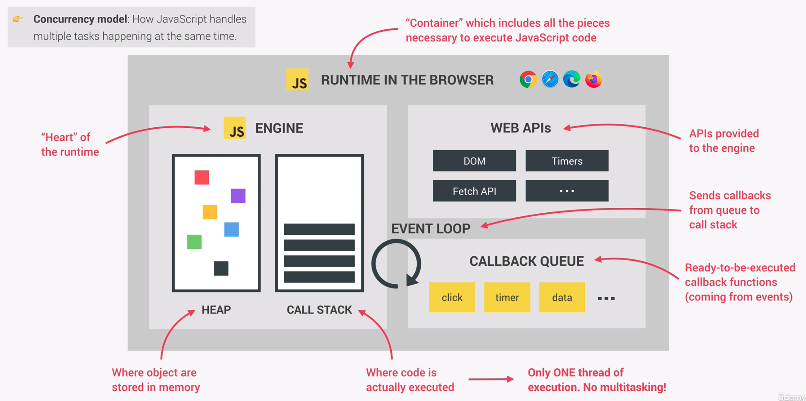

# Asynchronous Behing the Scenes: The Event Loop

The event loop is the essential part of the Javascript runtime, which makes asynchronous coding possible. It is why we can have a non-blocking concurrency model in Javascript. A concurrency model is the way a programming language handles multiple things happening at the same time.

## How it works

As we know a Javascript engine is built around the idea of a single thread, that can execute one task at a time. But then how is it possible to have non-blocking behaviour in JS?

This is because of the Web APIs, where asynchronous tasks are actually executed, and which are not part of the Javascript engine itself. Again, all asynchronous tasks are run in the Web APIs environment of the browser.

In this example the setting of the src of the image is outsourced in the Web API. Also the eventHandler of the eventListener is processed in the 'background', namely the Web API. The same is true for fetching data from an API and the appended then method.

Let's take the image as an example:
When setting the src of the image, this task will asynchronously be handled in the Web API's environment. Also when the line of the eventListener is reached, its handler will be transferred to this environment, where it waits for the load event to be fired.

If the image sucessfully loaded in the background, the load event is triggered and the eventHandler is transported into the callback queue. In the callback queue the handler waits for its turn to be pushed into the callstack by the event loop. The execution is now influenced by how many other tasks are currenty in the queue.

That means, if we set a timeout, which is also an asynchronous taks, and set it to 5 seconds, it is guaranteed to not be executed before that specified time. However, it is NOT guaranteed to be executed at exactly at 5 seconds, because this is just the time for it to be pushed into the callback queue. So depending on how many tasks are pending in the queue, our timeout function will be executed when all the other tasks which come before it, are finished executing one by one in the call stack.

Now if our eventHandler finally gets taken from the callback queue into the call stack by the event loop, we call this an **event loop tick**.

We can say that the event loop has the extremely important task of coordinating between the tasks in the call stack and the pending callback tasks in the callback queue. The event loop is the instance which decides when each callback is executed. Hence it can be seen as the one who is orchestrating the entire Javascript runtime.

We also realize that Javascript engine itself has no sense of time by itself. This is because everything that is not synchronous does not happen in the engine. It is the runtime that manages the asynchronous behavious, and it is the event loop, which decides which code will be executed next. The engine itself simply executes the code which it receives one after the other.

## How it works: Promises/Microtasks

Regarding the AJAX call, which we make with the fetch function, things work slightly different.

Callbacks related to promises do **NOT** go in the callback queue, but have a special queue just for themselves, which is called the **microtasks queue**.

We also call callbacks coming from a promise a **microtask**, hence the name microtask queue.

The microtask queue has proiority over the callback queue, which means that  before an event loop tick, the event loop will check for tasks in the microtasks queue and will run all of those tasks, before running any task from the callback queue. This also applies if a microtask adds a new microtask to the queue.

Theoretically, the microtask queue could *starve* the callback queue, if microtasks would repeatedly add new microtasks to the queue. Then no task from the callback queue would ever be executed. Practically speaking, this is rarely a real problem, though.

