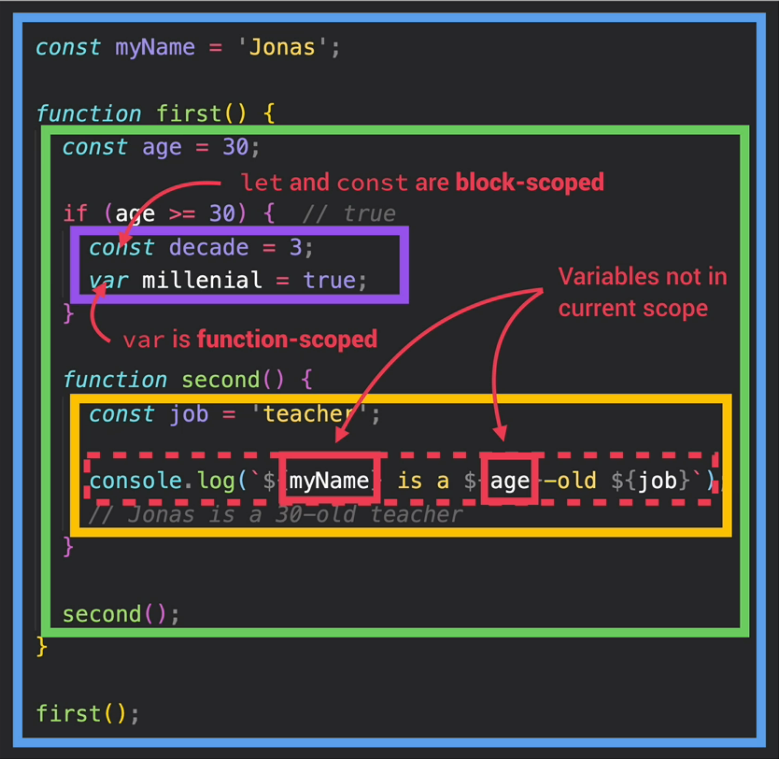
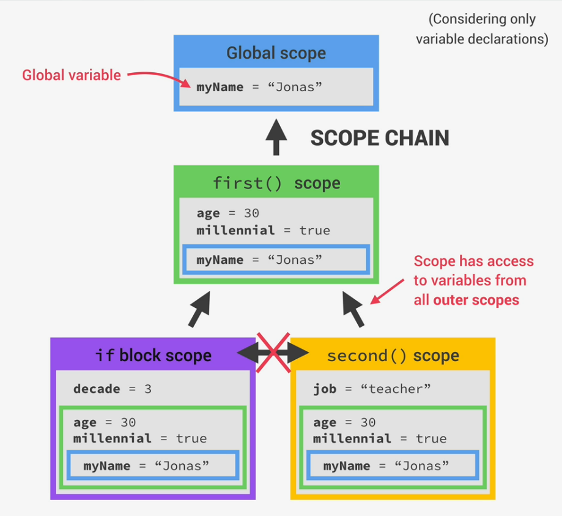

# Javascript Call Stack and Execution Contexts

### Execution contexts

After compilation the execution phase is entered. The first thing to happen is the **creation of a global execution context** for the **top-level code**. Javascript always runs inside of an execution context, which is an environment in which a piece of code is executed. It stores all the necessary information for some code to be executed, like variables or arguments passed into a function. There is only ever <u>ONE</u> global execution context (EC) in every Javascript project. This is created as a default context and it is where top-level code is executed.
Simply put, **top level code** is code, that is not inside of a function. So in the beggining only code that is not inside of any function is executed. This makes sense, since functions should only be executed when they are called.

After the creation of the global execution context, the top level code inside of this context can be executed.

Finally functions can be executed and Javascript is waiting for callbacks (generally speaking: a function which is to be executed after another function has finished execution). For example, a callback of a function can be an event-handler function, which is being called if an event, like a click, occurs.
For every function being called, a new execution context is created. All those new contexts together make the **call stack**.

#### But what does an execution context consist of?

1. First, there is a **variable environment** where all variables (let, const, var), functions and arguments are stored. The arguments are stored inside of an arguments object, which contains all the arguments for the functions, that belong to the currently executed execution context. Remember: each function gets its own execution context as soon as it is called.

2. Since functions can also access variables outside of their scope, this is where the **scope chain** comes into play. Basically the scope chain consists of references to variables located outside of the current function. To keep track of the scope chain it is stored in each execution context.

3. Finally, each context also gets a special variable, called the **this keyword**.

All of the steps listed above belong to the so caled *creation phase*, which happens right before execution.
But technichally, values only become known during the execution phase.

**IMPORTANT DETAIL:** Executions contexts belonging to **arrow functions** do **NOT** get the **arguments object** nor the **this keyword**. Instead they can use the arguments object and the this keyword of their closest regular function parent.

### Call Stack

How will the engine keep track of the order in which functions are called? How will it know where it currently is in the execution?
This is where to call stack comes into play. Remember that the call stack together with the memory heap, make up the javascript engine itself.
The call stack is the "place" where execution contexts get stacked on top of each other, to keep track of where we currently are in the execution of the program. So the execution context, that is on top of the stack, is the one, that is currently running. When execution context is finished running, it will be removed from the stack and the execution will return to the previous context in the call stack.

The callstack is something like a map for the Javascript engine. The callstack ensures that the order of execution never gets lost.

##  Scope and Scope Chain

### Scope:

**Scoping** tells us how our program's variables are organized and accessed. *"Where can we access a certain variable, and where not?"*

Javascript uses **lexical scoping**, which enables us to access variables of outer scopes from inner scopes, but not vice versa. So children scopes have access to the variables of their parents, but parents do not have access to the variables of their children. Also siblings do not have access to the variables of other siblings.

The **scope** is the environment in which a certain variable is declared. There are 3 types of scope, which are:

**1. Global scope:**
- outside of any function or block
- variables declared in global scope are accessible everywhere

**2. Function scope:**
- Variables are accessible only inside function, NOT outside
- also called ***local scope***

In case of functions, the scope is basically the same as the variable environment.

**3. Block scope (ES6):**
- a block is everything, that is between curly braces
- variables are only accessible insde of the block
- **IMPORTANT:** This only applies to *let* and *const* variables (*let* and *const* are block scoped, *var* is function scoped)
- Functions are **also block scoped**, but only in ***Strict Mode***

The **scope of a variable** is the region of our code where a certain variable can accessed.

### Scope Chain:

When a variable is used in Javascript, the JavaSsript engine will try to find the variable's value in the current scope. If it could not find the variable, it will look into the outer scope and will continue to do so until it finds the variable or reaches global scope. This process builds the **scope chain**. The process itself is called **variable lookup**.

### Scope Chain vs Call Stack:

The call stack is the order in which functions were ***called***.

The scope chain is the order in which functions are ***written in the code***. So the scope chain has nothing to do with the order in which functions were called, respectively it has nothing to do with the order of the execution contexts in the call stack. It does get the variable environments from the execution contexts, but that's it. The order of function calls is not relevant to the scope chain at all.

The scope chain in a certain scope is equal to the sum of all the variable environments of the parent scopes.