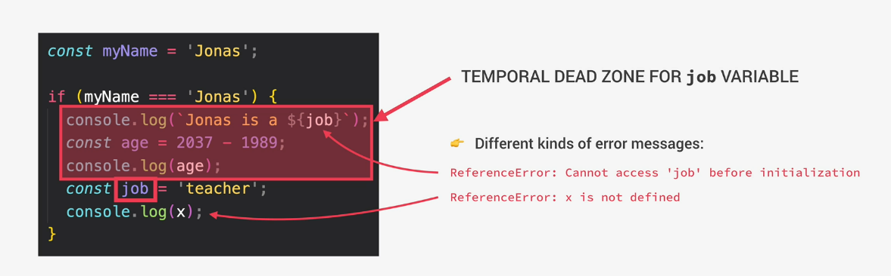

# Hoisting in Javascript

Hoisting is the process that makes it possible to make some variables accessible or usable BEFORE they are actually declared in the code.
Before execution, in the creation phase, the code is scanned for variable declarations and for each variable, a new property is created in the variable environment object.
Hoisting does not work the same for all variable types.

- **function declarations**
        1. Hoisted: YES
        2. Inital value: Actual function  
        3. Scope: Block ==> ONLY STRICT MODE, otherwie function scoped
- **var variables**:
        1. Hoisted: YES
        2. Initial value: undefined
        *When we want to access a var variable before it is declared in the code, we receive undefined, which is weird and not useful. We'd expect an error*
        3. Scope: function
*var hoisting was just byproduct of making function declarations accessible before declaration, this is why we should let and const in modern Javascript instead*
- **let and const**:
        1. Hoisted: NO, *but technically yes, but not in practice since the inital value is set to uninitalized, so there's no value to work with and as if hoisting is not happening at all*
        2. Inital value: \<uninitalized>\, TDZ (Temporal dead zone)
        *instead the variables are stored inside the TDZ, so we cannot use the variables between the beggining of the scope and the place where they are declared*
        3. Scope: Block
- **function expressions and arrows**:
        - depends if they are declared using let/const or var 🤷

## TDZ - Temporal Dead Zone

The main benefit of the TDZ is that it makes it easier to avoid and find errors, since accessing variables beore declaration is a bad practice and should be avoided.
Also it is the main reason why the const variable actually work. Const cannot be set to undefined and assign their value later.

## Examples

#### Variables

    console.log(me);    ==> returns undefinded
    console.log(job);   ==> Uncaught ReferenceError: Cannot access 'job' before initialization
    console.log(year);  ==> see above

    var me = 'Max';
    let job = 'student'; ==> TDZ from here to top of scope
    const year = 1991;

#### Functions

    console.log(addDecl(2,3))   ==> returns 5
    console.log(addExpr(2,3))   ==> Uncaught ReferenceError: Cannot access 'addExpr' before initialization
    console.log(addArrow(2,3))  ==> Uncaught TypeError: addArrow is not a function; this is because var is hoisted and the initial value is set to undefined

    function addDecl(a,b) {
        return a + b;
    }

    const addExpr = function(a,b) {
        return a + b;
    }

    var addArrow = (a,b) => a+b;

## Concluding good practices
1. Never use var, use const as often you can and let only if you are sure that you reassign those values in the future
2. Try to only call functions after they are declared in the code, even for hoisted function declarations