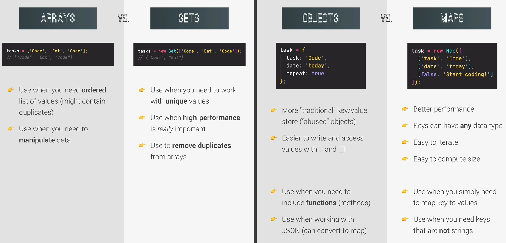

# Which Data Structure should I use?

In Javascript we can categorize three sources of incoming data, which we want to collect in a data structure:

1. From the prgoram itself: Data written directly in source code
2. From the UI: Data input from the user or data written in the DOM
3. From external sources: Data fetched from a web API for example

We decide upon which data structure to use based on wether the incoming data can be stored in a simple list (then arrays and sets) or if naming of the values is required, because of a more complex structure (objects and maps).
A common case in Javascript application is that we receive data from a web API, which allows us to get data from different web applications. Data from web API's comes in the data fortmat JSON. JSON is basically just text, but can easily be converted to Javascript, because it uses the same formatting as Javascript objects and arrays.

## Arrays vs. Sets vs. Maps vs. Objects

